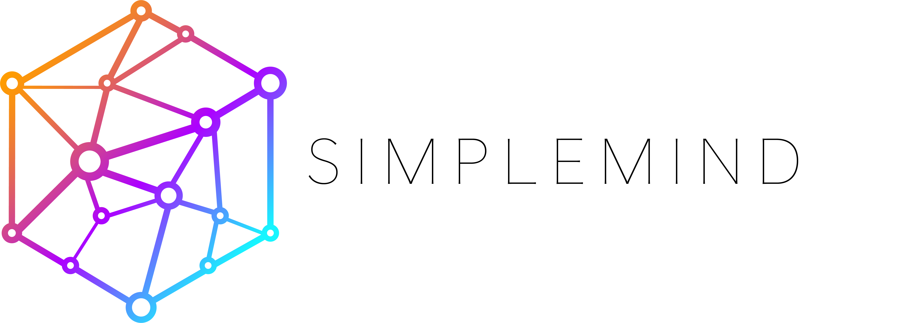
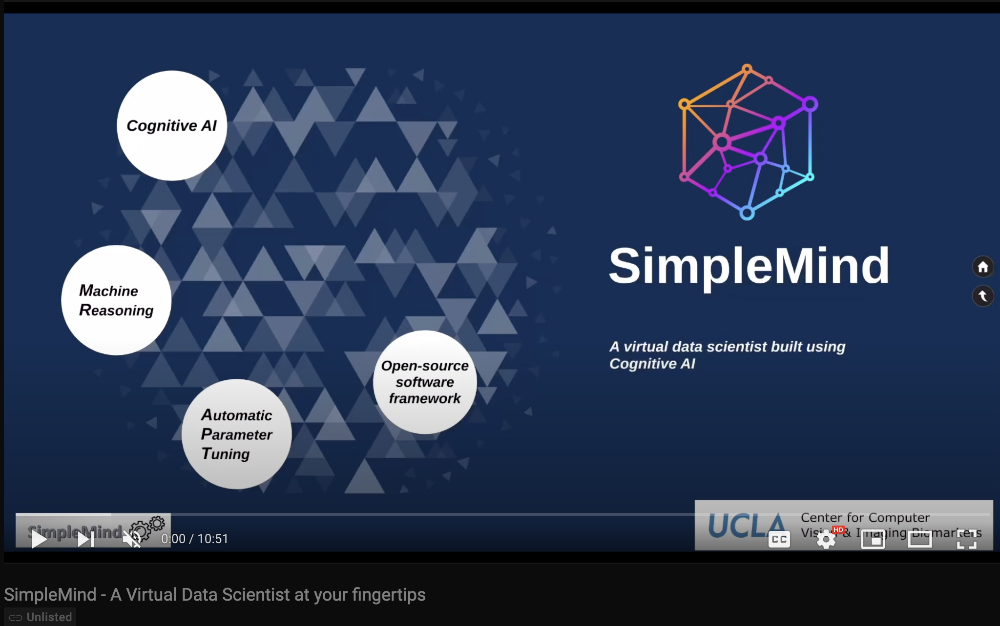
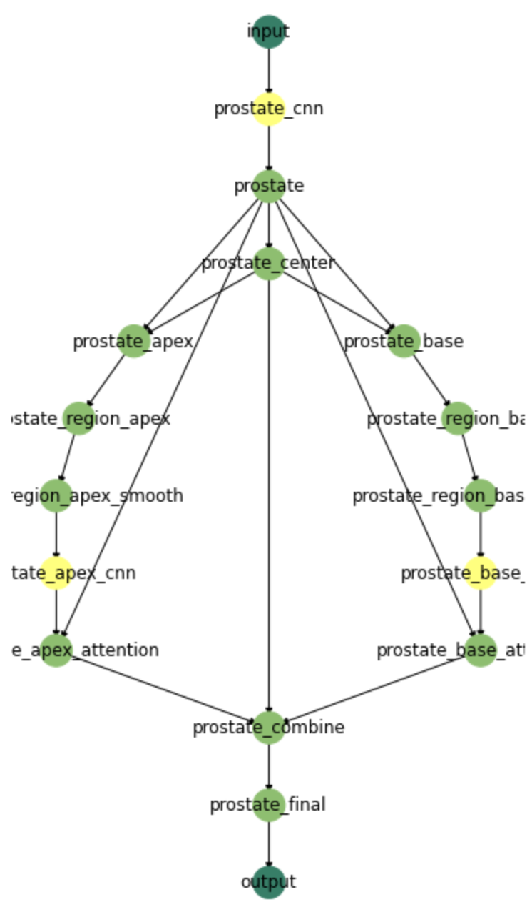
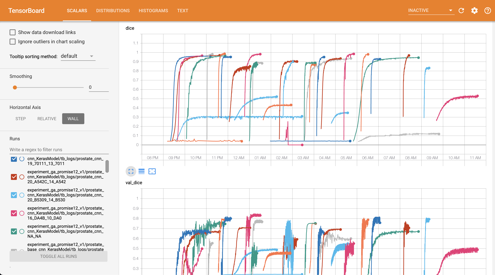
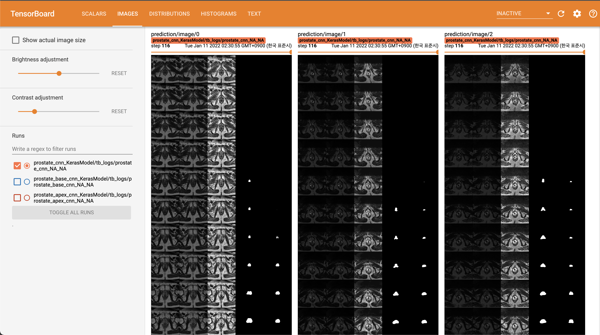

# SimpleMind adds thinking to deep neural networks

<!-- badges (build / coverage / pypi version) -->

[](https://gitlab.com/sm-ai-team/simplemind/-/commits/develop)



## A framework for Cognitive AI 

SimpleMind is a Cognitive AI software framework that supports neural networks with machine reasoning and automatic parameter tuning.

<!-- SimpleMind can act as a virtual scientist using Cognitive AI to support human data scientists to achieve a more reliable AI in clinical practice.  -->
SimpleMind can act as a virtual data scientist using Cognitive AI to achieve a more reliable AI in clinical practice.
The synergistic work of machine reasoning (MR) and automatic parameter tuning (APT) brings two major benefits: (1) making it easier for a data scientist to teach, train, and optimize the AI, (2) better segmentation accuracy and reliability, with common sense reasoning to avoid obvious mistakes.

SimpleMind (SM) framework provides both completed applications for some public problems, and the software development toolkits (SDK) to build your own application. Our system contains the SM vocabulary for the semantic network, SM runner, SM optimizer, and visualization toolkit.

<!-- blank line -->
<iframe width="560" height="315" src="https://www.youtube.com/embed/GWX-6-Fw0ik" title="YouTube video player" frameborder="0" allow="accelerometer; autoplay; clipboard-write; encrypted-media; gyroscope; picture-in-picture" allowfullscreen></iframe>
<!-- blank line -->

<!-- [](https://www.youtube.com/watch?v=GWX-6-Fw0ik) -->

[](https://www.youtube.com/watch?v=GWX-6-Fw0ik)

### Documentation

Please see the [documentation](https://sm-ai-team.gitlab.io/simplemind/sm.html) for further details and examples.
This documentation is for the previous version of sm framework, which has been used extensively at UCLA.

A new documentation is under construction to reveal the next version of user-friendly sm open-source.

## **Installation**

### Using Docker

```bash
# pull the latest Docker image
docker pull smaiteam/sm-develop

# test installation
docker run -it -u $(id -u):$(id -g) -v $PWD:/workdir -w /workdir smaiteam/sm-develop:latest bash -c "python -c 'import simplemind; print(simplemind.__version__)'"
```

## **Getting started**

### SimpleMind Semantic Network

SimpleMind (SM) use a semantic network that contains nodes built with the cognitive elements and Neural Network (NN) elements.



The figure summary generated from our visualization tool shows the text-based SimpleMind semantic network intuitively. The yellow dots demonstrate NN elements and the light green dots indicate cognitive elements. Complex chaining of these elements leads to increasing the level of intelligence.

### SM runner

SM runner supports the Python API. With the existing SimpleMind application, the SM runner operates in [RUN] mode to execute the SimpleMind application.

- Python API

```python
from simplemind import sm

example_path = "/workdir/examples/promise12_prediction"
image_path = f"{example_path}/data/Case20.mhd"
sn_list_file = f"{example_path}/sm_model_promise12_naive/prostate_model"
output_dir = f"{example_path}/output_Case20"

sm.runner(image_path = image_path, sn_entry_path = sn_list_file, output_dir = output_dir)
```

A 3D visualization tool will demonstrate the reasoning of each node for better prediction.
When developing an SM model for your own problem, SM runner will train your model automatically in DEV model. 

### SM APT

SM APT supports end-to-end parameter tuning for all the agent parameters and learning hyperparameters exposed in the SM application. A summary tool will help you track automatic tuning and training.

A tensorboard is supported to monitor the parallelized training of all the DNN nodes from multiple models. Each line indicates the learning curve of the DNN node from each SM model.



Detailed tensorboard including the image summary showing the progress of the segmentation DNN nodes from an SM model is also available.



The initial scope of SimpleMind will be for image understanding - segmenting and recognizing objects and forming a coherent mental model of a scene where high level reasoning can be performed.

## **Example**

<!-- `examples` folder contains some jupyter notebook and bash file examples. -->
The jupyter notebook example for prostate segmentation using PROMISE12 shows the usage of SM python API. ([link](examples/promise12_prediction/SM_run_promise12.ipynb))

## **License**

SimpleMind is licensed under the 3-clause BSD license. For details, please see the LICENSE file.

## **History**

The project started in the [Center for Computer Vision & Imaging Biomarkers (CVIB)](https://cvib.ucla.edu/) at University of California, Los Angeles (UCLA).

## **Authors and acknowledgment**

Show your appreciation to those who have contributed to the project.

### Maintainer

- Matthew S Brown <[mbrown@mednet.ucla.edu](mailto:mbrown%40mednet.ucla.edu)>
- Youngwon Choi <[youngwonchoi@mednet.ucla.edu](mailto:youngwonchoi@mednet.ucla.edu)>
- Wasil Wahi <[mwahianwar@mednet.ucla.edu](mailto:mwahianwar@mednet.ucla.edu)>
- John Hoffman <[johnmarianhoffman@gmail.com](mailto:johnmarianhoffman@gmail.com)>

### **Contributors**

- Gabriel Melendez-Corres
- Liza Shrestha
- Mitch Murphy
- Morgan Daly
- Pangyu Teng
- Koon-Pong Wong

This package was builded on the [Keras](https://keras.io/) and the [Tensorflow](https://www.tensorflow.org/tutorials) packages.
## **Project status**

Under construction
---


